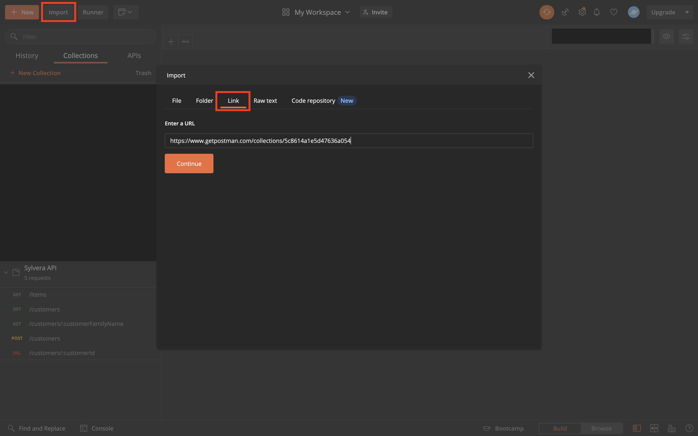

# Sylvera APIs

This project contains a set of APIs designed to interact with user and order data.

The APIs are written in NodeJs with Typescript, using Koa and Knex. The data layer is using better-sqlite3.

## Running

First install dependencies:

`npm install`

Then run the server locally:

`npm start`

This will launch the server at `localhost:3000`

## Endpoints

You can either use this list of endpoints here, or call the Postman endpoints listed below

* GET `localhost:3000/healthcheck`

Returns 200

* GET `localhost:3000/customers`

Get all Customers in the Database

* GET `localhost:3000/customers/:customerFamilyName`

Get all Customers with a given Family Name
Note: (This should change to ID probably rather than customerFamilyName, it's just more interesting)

* POST `localhost:3000/customers/`

Creates a Customer
Body: 

```json
{
    "email": "oliver.nural@gmail.com",
    "given_name": "Olly",
    "family_name": "Nural"
}
```

* DELETE `localhost:3000/customers/:customerId`

Deletes a given Customer from the Database

* GET `localhost:3000/items`
  
Get all Items from the Database
## Postman

A Postman collection has been created, with a link here: https://www.getpostman.com/collections/5c8614a1e5d47636a054

Go to the Postman App -> Import -> Link.



## Testing

There are mainly Unit tests for this application. The code is split out into Routes -> Services -> Queries.

The Services are fairly well tested, and are tested in isolation, mocking the Database calls as well as the server.

@TODO - Abstract out the ctx.throw() logic into the route perhaps, to allow for easier testing. Unsure on this one, but the testing could be nicer.

A suite of integration/E2E tests would be useful to add, however I did not have time. These tests would mostly cover affecting the Database through either a Post or Delete, and retrieving the data using a GET, and comparing this data. A mock database should be called. 

## Choices

### Things to add

Validation on endpoints using Joi - some user input is necessary before moving forward, as this present a security risk.

Currently we can create a new customer with the same data passed in, every single time. Perhaps there should be some validation on users with the same given_name and family_name?
### Local running

In a Production environment, I would run this code either in a Docker container or in a Lambda. In either case, the build pipeline will run install, lint, test etc and then build and compile the Typescript.

### Logging

Using Winston and JSON formatting, Access Logs are printed on each request:

```json
{
  message: {
    url: '/customers/',
    reqBody: {
      email: 'oliver.nural@gmail.com',
      given_name: 'Olly',
      family_name: 'Nural'
    },
    method: 'POST'
  },
  level: 'info',
  service: 'user-api',
  timestamp: '2022-03-21T23:10:26.665Z'
}
{
  message: 'Created',
  status: 201,
  level: 'info',
  service: 'user-api',
  timestamp: '2022-03-21T23:10:26.677Z'
}
```

### Further work

Happy to talk further about deployment, pipelines, automation etc in a further conversation
